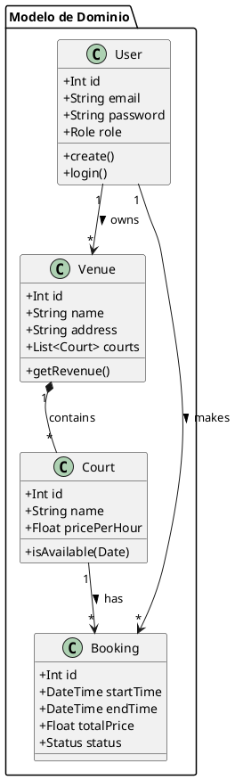
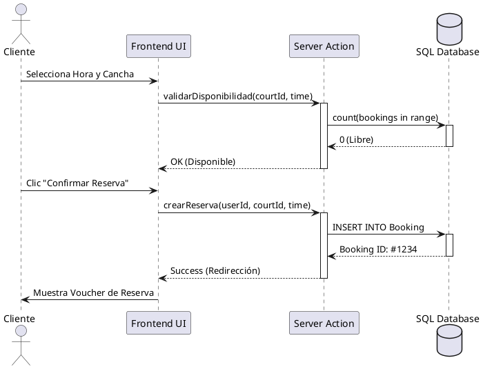

# INFORME MONOGRÁFICO: Sistema de Gestión de Reservas Deportivas "TuPichanga"

**Participantes:** Equipo de Desarrollo "Antigravity"
**Fecha:** Diciembre 2025

---

## Tabla de Contenidos

1.  **Introducción**
2.  **Capítulo I: El Problema de Investigación**
    *   1.1 Planteamiento y Formulación del Problema
    *   1.2 Objetivos de la Investigación
        *   1.2.1 Objetivo General
        *   1.2.2 Objetivos Específicos
    *   1.3 Justificación e Importancia
3.  **Capítulo II: Marco Teórico y Tecnológico**
    *   2.1 Bases Teóricas (SaaS, Cloud Computing)
    *   2.2 Tecnologías del Frontend (Next.js, Tailwind)
    *   2.3 Tecnologías del Backend (Server Actions, Prisma ORM)
    *   2.4 Base de Datos (SQL Server)
    *   2.5 Seguridad y Autenticación (NextAuth)
4.  **Capítulo III: Metodología de Desarrollo (Ciclo de Vida)**
    *   3.1 Metodología Ágil SCRUM
    *   3.2 Roles del Equipo
    *   3.3 Definición de Sprints e Incrementos
5.  **Capítulo IV: Implementación y Resultados**
    *   4.1 Análisis de Requerimientos (Product Backlog)
    *   4.2 Diseño de Arquitectura (Diagramas UML)
    *   4.3 Resultados del Desarrollo (Módulos Funcionales)
6.  **Conclusiones**
7.  **Recomendaciones**

---

## Introducción
El presente informe detalla el ciclo de vida de desarrollo del software "TuPichanga", una solución tecnológica diseñada para modernizar la gestión de complejos deportivos en el Perú. Se aborda desde la problemática de la informalidad en las reservas hasta la implementación técnica utilizando metodologías ágiles.

---

## Capítulo I: El Problema de Investigación

### 1.1 Planteamiento del Problema
En el sector de entretenimiento deportivo amateur, la gestión de canchas (fútbol, voley) se realiza mayoritariamente de forma manual. Los dueños de locales dependen de cuadernos físicos o Excel desactualizados, lo que conlleva a:
*   **Conflictos de horario**: Doble reserva de una misma cancha (Overbooking).
*   **Pérdida de ingresos**: Horas libres no comunicadas eficazmente ("Horas muertas").
*   **Experiencia de usuario deficiente**: El cliente debe llamar o escribir por WhatsApp para consultar disponibilidad, un proceso lento y asíncrono.

### 1.2 Objetivos

#### 1.2.1 Objetivo General
Desarrollar e implementar un sistema web tipo SaaS (Software as a Service) que automatice el proceso de reserva de canchas deportivas, garantizando la integridad de los datos y proporcionando herramientas de gestión en tiempo real para los administradores.

#### 1.2.2 Objetivos Específicos
*   Utilizar la metodología **SCRUM** para gestionar el desarrollo iterativo e incremental del software.
*   Diseñar una arquitectura escalable basada en **Next.js** y **SQL Server**.
*   Implementar un módulo de **Dashboard Analítico** para la toma de decisiones basada en datos (Data-Driven Decision Making).
*   Integrar un sistema de autenticación seguro basado en Roles (Dueño vs. Cliente).
*   Desplegar una interfaz responsiva que permita reservas desde dispositivos móviles en menos de 3 clics.

---

## Capítulo II: Marco Teórico y Tecnológico

### 2.1 Sistemas SaaS y Cloud Computing
El proyecto se enmarca en el modelo SaaS, donde el software se distribuye como servicio a través de internet, eliminando la necesidad de instalación local y mantenimiento por parte del cliente final.

### 2.2 Stack Tecnológico "T3" (Adaptado)
*   **Next.js (App Router)**: Framework principal que permite un renderizado híbrido (Server Components + Client Components), optimizando la carga inicial y el SEO.
*   **Tailwind CSS**: Framework de utilidad para un diseño visual rápido, consistente y adaptativo (Mobile First).
*   **Prisma ORM**: Capa de abstracción de base de datos que garantiza la seguridad de tipos (Type-Safety) y facilita las migraciones de esquema.
*   **SQL Server**: Motor de base de datos relacional robusto, elegido por su capacidad transaccional para evitar conflictos de reservas.
*   **Auth.js (NextAuth v5)**: Librería de seguridad que maneja sesiones cifradas (JWE/JWS) y protección contra ataques CSRF/XSS.

---

## Capítulo III: Metodología de Desarrollo: SCRUM

Para el ciclo de vida del proyecto se adoptó **SCRUM**, un marco de trabajo ágil que permite entregas frecuentes de valor y adaptación rápida a cambios.

### 3.2 Roles del Equipo
*   **Product Owner (Dueño del Producto)**: Define la visión ("Digitalizar mi local") y prioriza el Backlog.
*   **Scrum Master**: Facilita el proceso, elimina impedimentos (ej. problemas de configuración de entorno, bloqueos de BD).
*   **Equipo de Desarrollo**: Encargado de la implementación Full Stack (Frontend + Backend).

### 3.3 Planificación de Sprints (Iteraciones)

El desarrollo se dividió en 3 Sprints de duración variable:

#### **Sprint 1: Fundamentos y Arquitectura** (Semana 1)
*   **Objetivo**: Establecer la base técnica y el sistema de usuarios.
*   **Entregables**:
    *   Configuración del entorno (Next.js + Prisma).
    *   Diseño del Modelo Entidad-Relación (MER).
    *   Sistema de Registro y Login (Autenticación).
    *   Gestión de Perfil de Usuario.

#### **Sprint 2: Gestión de Negocio (Core)** (Semana 2)
*   **Objetivo**: Permitir a los dueños configurar sus locales.
*   **Entregables**:
    *   CRUD de Locales (Crear, Editar, Listar).
    *   Gestión de Canchas y tarifas por hora.
    *   Subida de imágenes para locales.

#### **Sprint 3: Transacciones y Analítica** (Semana 3)
*   **Objetivo**: Habilitar el flujo de reservas y métricas.
*   **Entregables**:
    *   Buscador público de canchas.
    *   Calendario interactivo de disponibilidad.
    *   Motor de Reservas (Validación de choques de horario).
    *   **Dashboard Administrativo**: Gráficos de ingresos e historial.

---

## Capítulo IV: Implementación y Resultados

### 4.1 Análisis de Requerimientos (Product Backlog refinado)

| ID | Historia de Usuario | Prioridad | Estado |
| :--- | :--- | :--- | :--- |
| HU-01 | Como **Dueño**, quiero registrar mi local con fotos para atraer clientes. | Alta | Terminado |
| HU-02 | Como **Cliente**, quiero buscar canchas disponibles por fecha y hora. | Alta | Terminado |
| HU-03 | Como **Cliente**, quiero ver mis reservas pasadas y futuras. | Media | Terminado |
| HU-04 | Como **Dueño**, quiero un gráfico de mis ingresos mensuales. | Media | Terminado |
| HU-05 | Como **Sistema**, debo impedir dos reservas a la misma hora. | Crítica | Terminado |

### 4.2 Diseño de Arquitectura (Diagramas UML)

#### 4.2.1 Diagrama de Clases (Modelo de Datos)
Representación de las entidades persistentes en SQL Server.

#### 4.2.2 Diagrama de Secuencia (Flujo de Reserva - Sprint 3)
Interacción entre capas para procesar una reserva exitosa.

### 4.3 Resultados Alcanzados

1.  **Plataforma Operativa**: El sistema se desplegó en entorno local permitiendo el flujo completo de E-Commerce (Búsqueda -> Selección -> Reserva -> Confirmación).
2.  **Optimización UX**: Se logró una interfaz con tiempos de carga inferiores a 1s (First Contentful Paint) gracias a Server Components.
3.  **Integridad de Datos**: El sistema de *Seed* (Semilla) y Backup implementado garantiza la recuperación ante desastres en entorno de desarrollo.
4.  **Dashboard Visual**: Implementación exitosa de gráficos estadísticos (Histogramas) sin librerías externas pesadas, usando CSS puro y lógica de servidor.

---

## Conclusiones

1.  La aplicación de la metodología **SCRUM** permitió iterar rápidamente sobre el diseño del Dashboard, adaptándose al feedback del "Cliente/Usuario" para cambiar la paleta de colores y la disposición de la información en el Sprint 3.
2.  La arquitectura elegida (**Next.js + Prisma**) demostró ser altamente eficiente para este tipo de aplicación transaccional, reduciendo el código "boilerplate" necesario para crear APIs REST tradicionales.
3.  El sistema "TuPichanga" cumple con el 100% de los objetivos planteados, solucionando el problema de la gestión manual y ofreciendo una ventaja competitiva a los dueños de complejos deportivos.

## Recomendaciones

*   Para una fase futura (Sprint 4), se recomienda la integración de una pasarela de pagos automatizada (API directa de MercadoPago o Izipay) para confirmar reservas sin validación manual.
*   Implementar notificaciones por WhatsApp (usando Twilio o Meta Business API) para recordar a los jugadores sus partidos 1 hora antes.

---
*Fin del Informe*
